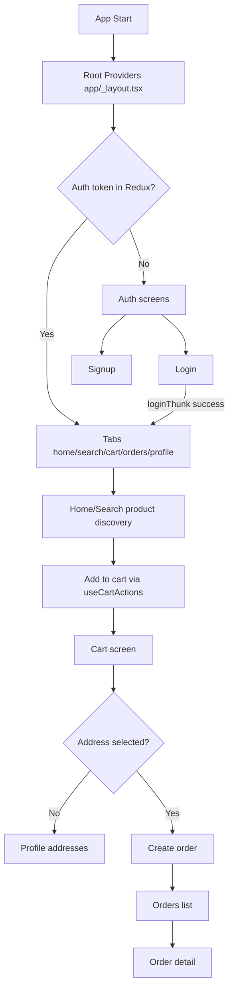
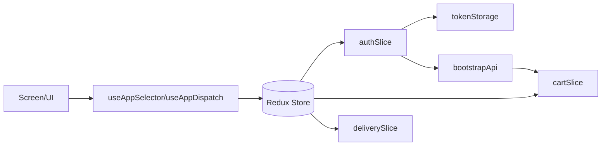
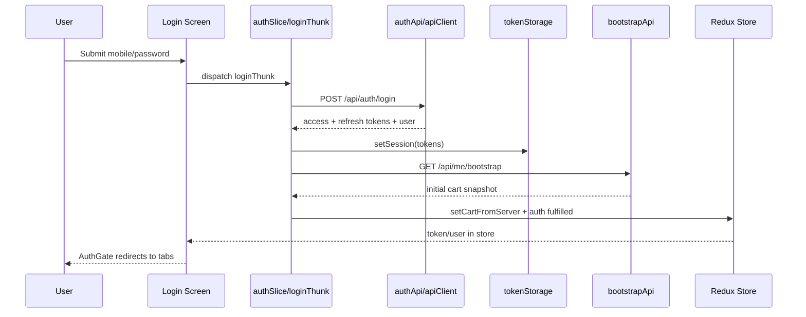
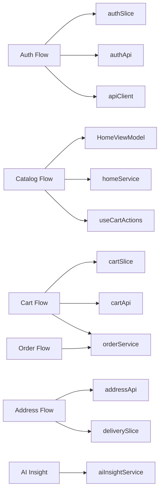

# BlinkDemo - Technical Project Documentation

## Project Overview
BlinkDemo is a React Native + Expo Router mobile app built with TypeScript. It implements an authenticated grocery-style shopping experience with catalog browsing, search, cart operations, address management, order placement/history, and an AI product insight panel.

Core framework/runtime in code:
- Expo SDK 54
- React Native 0.81
- Expo Router (file-based routing)
- Redux Toolkit + redux-persist
- AsyncStorage

Primary entry and shell:
- `app/_layout.tsx` mounts providers (Theme, Redux, PersistGate, Toast) and route stack
- `app/index.tsx` redirects based on Redux auth token

## Business Goal
Based on implemented screens/services, the app appears designed to:
- Demonstrate an end-to-end commerce flow (auth -> discover products -> cart -> checkout -> orders).
- Showcase production-style app architecture patterns (routing groups, service layer, Redux state, theming, toast infrastructure).
- Include an optional AI-assisted purchase decision helper for product detail pages.

## Features
Implemented features confirmed in source code:
- Authentication: login, signup, logout.
- Auth route gating: redirects unauthenticated users to login.
- Home catalog: categories, subcategories, product grid.
- Search: debounced product search with item navigation.
- Product detail page: add/remove quantity and AI insight panel.
- Cart: quantity updates, subtotal, checkout flow.
- Address management: list, add, edit, delete, set default/selected.
- Address map picker: map tap/drag + current-location support.
- Order management: list orders + order details.
- Theme system: light/dark mode toggle with persistence.
- Toast notifications: global toasts callable from UI/services.

## User Journey
1. App launches.
2. Root gate checks token from Redux auth slice.
3. If not logged in: user lands in auth flow (`/(auth)/login`).
4. User logs in; login thunk stores session and bootstrap cart.
5. User enters tab experience (`/(tabs)/home`).
6. User discovers products via Home or Search.
7. User adds/removes items (optimistic Redux + backend sync).
8. User opens cart and proceeds to checkout.
9. If no selected address, user is prompted to manage addresses.
10. User places order and is redirected to Home.
11. User tracks orders in Orders tab and order details page.

## Application Flow


## Screen Documentation

### app/index.tsx
- Responsibility: immediate redirect based on `auth.token`.
- No UI render.
- Redirect targets:
  - Logged in -> `/(tabs)/home`
  - Logged out -> `/(auth)/login`

### app/_layout.tsx
- Global providers:
  - ThemeProvider
  - Redux Provider
  - PersistGate
  - ToastProvider
- Defines root stack routes:
  - `(auth)`
  - `(tabs)`
  - `orders/[orderId]`
  - `profile/addresses`
  - `profile/address-form` (modal)
- Includes `AuthGate` logic using segments + Redux token.

### app/(auth)/_layout.tsx
- Auth stack layout.
- Configures auth headers and screen options.
- Screens: `login`, `signup`.

### app/(auth)/login.tsx
- Form fields: mobile + password.
- Validation:
  - mobile: 10 digits, starts 6-9
  - password: min 6 chars
- Dispatches `loginThunk`.
- Error surfaced via toast + inline text.

### app/(auth)/signup.tsx
- UI bound to `useSignupVM`.
- Fields: name, email, mobile, password, confirm.
- On success currently navigates back to login screen.

### app/(tabs)/_layout.tsx
- Bottom tab navigator for authenticated area.
- Tabs:
  - home
  - search
  - cart
  - orders
  - profile
- Header shows delivery address selector via `HeaderLocation`.

### app/(tabs)/home.tsx
- Uses `useHomeVM` for category/subcategory/item data.
- Renders product grid.
- Add/remove via `useCartActions`.
- Item tap navigates to `app/search/view-all.tsx` with item payload.

### app/(tabs)/search.tsx
- Debounced text search using `searchProducts`.
- Minimum 3 chars before querying.
- Item tap opens detail page (`/search/view-all`).

### app/search/view-all.tsx
- Product detail page behavior.
- Shows image, title, price, qty controls, description.
- AI insight section:
  - Auto-loads when product available and AI key enabled.
  - Refresh action for reanalysis.

### app/(tabs)/cart.tsx
- Builds cart rows from Redux cart + catalog products.
- Subtotal and checkout CTA.
- Checkout calls `createOrder` with selected address.
- On success clears cart and navigates home.

### app/(tabs)/orders.tsx
- Fetches order history via `getOrders()`.
- Displays card list with status and totals.
- Opens order details route.

### app/orders/[orderId].tsx
- Fetches single order via `getOrderById(orderId)`.
- Renders summary and line items.

### app/(tabs)/profile.tsx
- Shows user profile fields from auth store.
- Actions:
  - Manage addresses
  - Theme switch
  - Placeholder help/about
  - Logout via `logoutThunk`

### app/profile/addresses.tsx
- Lists addresses from backend.
- Card tap selects and sets default.
- Supports add/edit/delete/default selection logic.

### app/profile/address-form.tsx
- Add/edit address with react-hook-form + yup validation.
- Fields: label, addressLine, pincode, city, lat/lng, default flag.
- Map modal for location selection.
- Uses `upsertAddress` for persistence.

### app/address/select.tsx
- Placeholder TODO screen.
- Currently not integrated into active user flow.

## Complete Routing Structure

### Expo Router Paths
- `/` -> `app/index.tsx`
- `/(auth)/login` -> `app/(auth)/login.tsx`
- `/(auth)/signup` -> `app/(auth)/signup.tsx`
- `/(tabs)/home` -> `app/(tabs)/home.tsx`
- `/(tabs)/search` -> `app/(tabs)/search.tsx`
- `/(tabs)/cart` -> `app/(tabs)/cart.tsx`
- `/(tabs)/orders` -> `app/(tabs)/orders.tsx`
- `/(tabs)/profile` -> `app/(tabs)/profile.tsx`
- `/search/view-all` -> `app/search/view-all.tsx`
- `/orders/[orderId]` -> `app/orders/[orderId].tsx`
- `/profile/addresses` -> `app/profile/addresses.tsx`
- `/profile/address-form` -> `app/profile/address-form.tsx` (modal)
- `/address/select` -> `app/address/select.tsx`

### Route Diagram
```mermaid
graph TD
  Root[/] --> AuthGroup[(auth)]
  Root --> TabsGroup[(tabs)]

  AuthGroup --> Login[/login]
  AuthGroup --> Signup[/signup]

  TabsGroup --> Home[/home]
  TabsGroup --> Search[/search]
  TabsGroup --> Cart[/cart]
  TabsGroup --> Orders[/orders]
  TabsGroup --> Profile[/profile]

  Search --> ViewAll[/search/view-all]
  Home --> ViewAll
  Cart --> ViewAll

  Orders --> OrderDetail[/orders/:orderId]
  Profile --> Addresses[/profile/addresses]
  Addresses --> AddressForm[/profile/address-form]
```

## Folder Structure

### High-level tree (source-relevant)
```text
app/
  _layout.tsx
  index.tsx
  (auth)/
    _layout.tsx
    login.tsx
    signup.tsx
  (tabs)/
    _layout.tsx
    home.tsx
    search.tsx
    cart.tsx
    orders.tsx
    profile.tsx
  search/
    view-all.tsx
  orders/
    [orderId].tsx
  profile/
    addresses.tsx
    address-form.tsx
  address/
    select.tsx

src/
  components/
    CartBadge.tsx
    Loader.tsx
    common/
      CommonButton.tsx
      CommonCounter.tsx
      CommonText.ts
    Toast/
      ToastProvider.tsx
  hooks/
    useCartActions.ts
    useLoginViewModel.ts
  models/
    HomeModels.ts
    AuthModels.ts
    address.ts
  services/
    apiClient.ts
    config.ts
    tokenStorage.ts
    authApi.ts
    bootstrapApi.ts
    homeService.ts
    cartApi.ts
    addressApi.ts
    orderService.ts
    aiInsightService.ts
  store/
    store.ts
    hooks.ts
    slices/
      authSlice.ts
      cartSlice.ts
      deliverySlice.ts
  theme/
    colors.ts
    spacing.ts
    common.ts
    ThemeContext.tsx
  utils/
    currency.ts
    globalToast.ts
  viewmodels/
    HomeViewModel.ts
    SignupViewModel.ts
```

## Expo Router Architecture
- File-based routing under `app/`.
- Route groups used for logical partition:
  - `(auth)` for login/signup stack.
  - `(tabs)` for authenticated bottom tabs.
- Root stack in `app/_layout.tsx` hosts groups and modal/detail routes.
- Auth guarding implemented via `AuthGate` (`useSegments`, `useRootNavigationState`, `router.replace`).

## Components Inventory

### Shared components
- `CartBadge`:
  - Reads cart count and routes to cart.
- `Loader`:
  - Full-screen loading overlay.
- `CommonButton`:
  - Generic button with loading/disabled states.
- `CommonCounter`:
  - Quantity increment/decrement control.
- `CommonText`:
  - Typography style tokens.

### Infrastructure components
- `ToastProvider`:
  - Context + animation for global toast.
  - Registers `showGlobalToast` bridge.

## Redux/Zustand Store Documentation

### State management used
- Redux Toolkit is implemented.
- Zustand is not present in source.

### Store composition (`src/store/store.ts`)
- Reducers:
  - `auth`
  - `cart`
  - `delivery`
- Persistence:
  - `redux-persist` with AsyncStorage.
  - `auth` slice blacklisted from persistence.

### auth slice (`src/store/slices/authSlice.ts`)
- State:
  - token, refreshToken, expiry timestamps
  - user
  - isLoading, error
- Async thunks:
  - `loginThunk`:
    - calls `loginApi`
    - writes session via `setSession`
    - fetches bootstrap cart and dispatches `setCartFromServer`
  - `logoutThunk`:
    - clears session storage
    - removes selected AsyncStorage keys

### cart slice (`src/store/slices/cartSlice.ts`)
- State:
  - `items[]` with productId, quantity, price, etc.
- Actions:
  - addToCart
  - removeFromCart
  - setCartQty
  - deleteCartItem
  - clearCart
  - setCartFromServer
- Selectors:
  - `selectCartItems`
  - `selectCartCount`
  - `selectCartTotal`

### delivery slice (`src/store/slices/deliverySlice.ts`)
- State:
  - selectedAddressId
- Actions:
  - setSelectedAddressId
  - clearSelectedAddressId

### Store relationship diagram


## API Integration Details

### API base
- Configured in `src/services/config.ts`:
  - `BASE_URL = https://rahul007007tiwari.bsite.net`

### API client
- `src/services/apiClient.ts` provides:
  - `apiFetch`
  - `apiJson`
  - unified `ApiError`
  - auto auth header from stored session
  - token refresh flow (`/api/auth/refresh`) on 401
  - session-expired handling with toast + route redirect

### Backend envelope handling
- Multiple services expect a backend envelope shape:
  - `Success`, `StatusCode`, `Message`, `ErrorCode`, `TraceId`, `Data`
- Services map backend PascalCase data into front-end camelCase models.

### Implemented endpoints observed in code
- Auth:
  - `POST /api/auth/login`
  - `POST /api/auth/register`
  - `POST /api/auth/refresh`
- Bootstrap:
  - `GET /api/me/bootstrap`
- Catalog:
  - `GET /api/catalog/categories`
  - `GET /api/catalog/subcategories?categoryId=...`
  - `GET /api/catalog/products[?categoryId=...]`
  - `GET /api/catalog/search?q=...`
- Cart:
  - `GET /api/cart`
  - `POST /api/cart/upsert`
  - `DELETE /api/cart/:productId`
  - `POST /api/cart/clear`
- Addresses:
  - `GET /api/addresses`
  - `POST /api/addresses`
  - `PUT /api/addresses/:id`
  - `DELETE /api/addresses/:id`
  - `POST /api/addresses/:id/set-default`
- Orders:
  - `POST /api/orders/place`
  - `GET /api/orders`
  - `GET /api/orders/:orderId`

## Authentication Flow


## Catalog Flow
- Home view model (`useHomeVM`) flow:
  1. Fetch categories.
  2. Auto-select first category.
  3. Fetch subcategories + items for selected category.
  4. Auto-select first subcategory.
  5. Expose `filteredSubcats` and `filteredItems`.
- Search flow:
  - Debounced query (`300ms`, min 3 chars) -> `searchProducts`.

## Cart Flow
- UI actions call `useCartActions`.
- `useCartActions` performs optimistic Redux updates and backend sync via `cartApi`.
- Cart screen recomputes rows from cart slice + catalog products and supports checkout.

Important implemented behavior:
- Add operation reverts on backend failure.
- Remove operation currently does not restore prior quantity on backend failure.

## Address Management Flow
- Address list fetched in `profile/addresses` via `fetchAddresses`.
- Selection action updates default address through `setDefaultAddress`.
- Address create/edit handled by `profile/address-form` with yup schema.
- Map picker integration:
  - manual pin move
  - tap to set pin
  - current location via `expo-location`

## Order Management Flow
- Checkout in cart calls `createOrder({ addressId })`.
- On success:
  - cart is cleared
  - success alert shown
  - user navigated to home
- Orders tab calls `getOrders`.
- Order detail screen calls `getOrderById(orderId)`.

## AI Insight Feature (Implemented)
Implemented in:
- `src/services/aiInsightService.ts`
- `app/search/view-all.tsx`

Behavior:
- Builds product-focused prompt.
- Calls Groq chat completions API.
- Extracts/normalizes strict JSON response.
- Displays summary, pros/cons, health view, verdict, confidence, disclaimer.

Enablement condition:
- `canUseAiInsight()` depends on `AI_CONFIG.GROQ_API_KEY` non-empty.

## Services Documentation

### src/services/apiClient.ts
- Central HTTP client.
- Handles auth header, token refresh, error parsing, session-expired redirect.

### src/services/tokenStorage.ts
- AsyncStorage-based session persistence.
- Provides get/set/clear and expiration helper.

### src/services/authApi.ts
- Auth DTO mapping and API calls.
- Converts backend auth payload to frontend model.

### src/services/bootstrapApi.ts
- Fetches bootstrap data post-login (cart snapshot usage in auth thunk).

### src/services/homeService.ts
- Catalog queries + mapper functions.

### src/services/cartApi.ts
- Backend cart CRUD/upsert methods.

### src/services/addressApi.ts
- Address CRUD + default selection.
- Converts backend PascalCase to `UserAddress`.

### src/services/orderService.ts
- Order creation/list/detail APIs.
- Maps backend status codes to labels.

### src/services/aiInsightService.ts
- External LLM integration (Groq).
- JSON extraction + normalization for insight payload.

## Models & Types Documentation

### Home models (`src/models/HomeModels.ts`)
- `Category`
- `Subcategory`
- `Item`
- `Store` (declared but not a central active domain model in current screens)

### Auth models (`src/models/AuthModels.ts`)
- `SignupForm` type

### Address model (`src/models/address.ts`)
- `UserAddress`

### Service-level types
- Multiple services define local envelope/data response types for mapping.

## Theme System

### Dynamic theme
- Context: `src/theme/ThemeContext.tsx`
- Modes: `light | dark`
- Persistence key: `@blinkdemo_theme_mode`

### Theme tokens
- `src/theme/colors.ts`: light/dark palettes, `AppColors` type.
- `src/theme/spacing.ts`: spacing tokens.
- `src/theme/common.ts`: `createCommon(colors)` style factory.

### Usage pattern in screens
- Common pattern:
  - `const { colors, mode } = useTheme()`
  - `const common = useMemo(() => createCommon(colors), [colors])`

## Hooks Documentation

### src/hooks/useCartActions.ts
- Encapsulates cart mutation behavior with optimistic updates.
- Exposes:
  - `addItem`
  - `removeItem`
  - `deleteItem`
  - `setQty`
  - `busyMap` to prevent duplicate concurrent operations per product.

### src/hooks/useLoginViewModel.ts
- Local login helper hook with state and `login` function.
- Not used by current login screen implementation (screen uses `loginThunk` directly).

## Dependency Inventory (package.json)

### Runtime dependencies
- @hookform/resolvers
- @react-native-async-storage/async-storage
- @reduxjs/toolkit
- expo
- expo-location
- expo-router
- expo-status-bar
- react
- react-dom
- react-hook-form
- react-native
- react-native-maps
- react-native-safe-area-context
- react-native-screens
- react-redux
- redux-persist
- yup

### Dev dependencies
- @types/react
- typescript

### Dependency interaction diagram
```mermaid
graph TD
  App[Expo App] --> Router[expo-router]
  App --> RN[react-native]
  App --> Redux[@reduxjs/toolkit + react-redux]
  Redux --> Persist[redux-persist]
  Persist --> Storage[@react-native-async-storage/async-storage]
  App --> Forms[react-hook-form + yup + @hookform/resolvers]
  App --> Maps[react-native-maps + expo-location]
  App --> AI[Groq HTTP API via fetch]
```

## Security Review

### Positive practices
- Access + refresh token model is implemented.
- 401 refresh flow is centralized in `apiClient`.
- Session clear + forced login on expiry is implemented.
- Authorization header handled centrally, reducing duplication risks.

### Risks observed from current code
1. Token storage uses AsyncStorage (`tokenStorage.ts`), which is not secure enclave/keychain storage.
2. Extensive console logging is present across screens/services, including potential personal fields (name, email, mobile) in several auth/profile flows.
3. AI key handling inconsistency:
   - `AI_CONFIG.GROQ_API_KEY` is hardcoded as empty string in config.
   - `canUseAiInsight` checks this constant, so env-only setup claim is inconsistent.
4. Hardcoded production-like API base URL in source config.
5. Logout clears session but does not explicitly reset persisted cart/delivery slices in Redux store state.

## Known Issues
1. Theme source files contain trailing markdown fence markers (` ``` `):
   - `src/theme/colors.ts`
   - `src/theme/spacing.ts`
   - `src/theme/common.ts`
2. Legacy Expo entry files (`App.tsx`, `index.ts`) coexist with Expo Router entry; they are not part of active router flow.
3. `app/address/select.tsx` is a TODO placeholder and not integrated.
4. Signup auto-login token persistence in `useSignupVM` does not synchronize Redux auth slice, while route gating depends on Redux token.
5. `useCartActions.removeItem` does optimistic decrement but does not rollback quantity on API failure.
6. Large volume of debug logging can affect performance and leak sensitive usage data in production logs.
7. No automated tests are present in the project scripts.

## Future Roadmap (Code-based recommendations)
1. Replace AsyncStorage token persistence with secure storage (Keychain/Keystore-backed solution).
2. Fix AI config key source to read from environment variable consistently.
3. Remove trailing markdown fence artifacts in theme files.
4. Align signup success path with Redux auth state (or route gating strategy).
5. Add rollback logic for cart decrement failures.
6. Add testing layers:
   - service unit tests
   - slice reducer tests
   - flow-level screen tests
7. Reduce production logging and centralize debug logger with environment gates.
8. Remove or integrate unused placeholder/legacy files.

## Change Impact Map

### High-impact modules and blast radius
- `src/services/apiClient.ts`
  - Impacts every networked feature (auth, catalog, cart, addresses, orders).
- `src/store/slices/authSlice.ts`
  - Impacts login/logout/session gate and initial cart bootstrap.
- `app/_layout.tsx`
  - Impacts navigation access control across entire app.
- `src/hooks/useCartActions.ts`
  - Impacts Home, Search, Product Detail, Cart quantity behavior.
- `src/theme/ThemeContext.tsx` and `src/theme/*`
  - Impacts all themed screens/components.

### Flow-to-module impact matrix


## Project Health Summary

### Current health
- Functional coverage: Good for demo-commerce lifecycle.
- Architecture layering: Good separation (UI/hook/viewmodel/service/store) with some inconsistencies.
- Routing architecture: Solid and explicit with auth guard.
- State architecture: Stable Redux setup with persistence and clear slices.
- Reliability: Moderate (some optimistic-update edge cases, missing test suite).
- Security posture: Moderate-to-low for production due to storage/logging/key handling choices.

### Overall assessment
- The project is a well-structured demo app with real end-to-end flows implemented.
- It is close to production shape in architecture, but requires hardening in security, consistency, and testing before production readiness.
